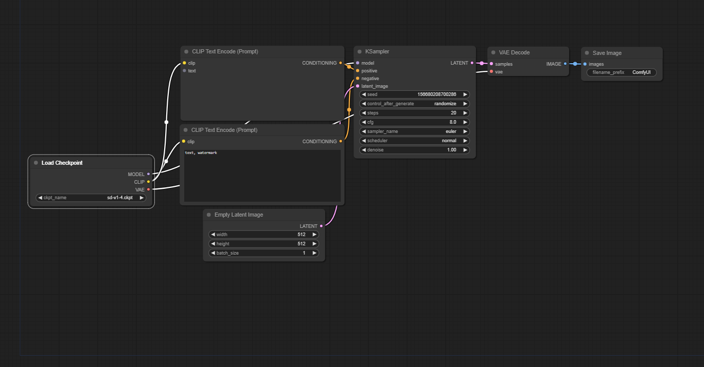

**Status: Fork in development**. It works on my machine. It might not on yours.
Let me know of any major issues by submitting an Issue.
I plan to do some fresh install testing when I have time.

## ComfyUI-SaveAsScript

ComfyUI-SaveAsScript (or SaS) is a fork of [ComfyUI-To-Python-Extension](https://github.com/pydn/ComfyUI-to-Python-Extension). It provides a more robust command-line interface and the ability to export your current workflow as a script directly from a button on the ComfyUI web interface.

Once exported, this script can be run to run the workflow without a frontend, or it can be imported and the `main()` function can be used to call the workflow programatically.

### New Feauture: Module Support

Now, scripts exported with SaS can be imported as modules! Once you have a script exported, you can use it like:
```python
>>> import exported_script
>>> results = exported_script.main("A prompt that would be sent to the command-line arguments", queue_size=1)
```

The first `SaveImage` node reached will instead *return* the output to the calling function. 

### New Feature: Custom Output Path

When running the exported script normally, you can now specify an `--output` option that will override the default path of `SaveImage` nodes.
If only a single image is exported by the node, then the path will be used verbatim. Otherwise, the path will be used as a prefix, and `_#####.png` will be appended
to ensure uniqueness. Note that files *will be clobbered* if only one image is exported.
If the path is a directory, the `SaveImage` node's `filename_prefix` will be used.

If `-` is selected as the output path, normal ComfyUI output will be piped to stderr and the resultant image will be piped to stdout, allowing one to use the script
like:
```bash
python3 script.py "A painting of outer space" --output - --queue-size 1 > image.png
```

### Usage (Web)

Upon installation, there will be a button labeled "Save as Script" on the interface, pictured below:


Click that button and enter your preferred name for the downloaded script (extension added automatically), and your file will be downloaded.

Note that if you use the script this way, you do **not** need to enable developer mode. You *will* if you use the CLI (to get the API JSON).

### Usage (CLI)

Navigating to the extension directory, you can also use the basic CLI included in the script to save your script without changing the Python file.

```bash
usage: comfyui_to_python.py [-h] [--output OUTPUT] [--queue-size QUEUE_SIZE] [--yes] workflow

Converts a ComfyUI-style workflow.json file to a Python file. Must have been exported with API calls

positional arguments:
  workflow              The workflow.json file to convert

options:
  -h, --help            show this help message and exit
  --output OUTPUT, -o OUTPUT
                        The output file (defaults to [input file].py)
  --queue-size QUEUE_SIZE, -q QUEUE_SIZE
                        The queue size per run
  --yes, --overwrite, -y
                        Overwrite the output file if it exists
```

### Arguments

It is now possible to pass command-line arguments to a generated script file. Any time a **required** input variable for *any* node in your the ComfyUI workflow is left unfilled, SaveAsScript will automatically convert that node into an argument.

For instance, if you have a simple default workflow, but have converted the text widget of the positive prompt into an input and left it unfilled like so:



Then the unfilled required variable will be available as an argument:
```bash
usage: default.py [-h] [--queue-size QUEUE_SIZE] [--comfyui-directory COMFYUI_DIRECTORY] text1

A converted ComfyUI workflow. Required inputs listed below. Values passed should be valid JSON (assumes string if not valid JSON).

positional arguments:
  text1                 Argument 0, input `text` for node "CLIP Text Encode (Prompt)" id 6 (autogenerated)

options:
  -h, --help            show this help message and exit
  --queue-size QUEUE_SIZE, -q QUEUE_SIZE
                        How many times the workflow will be executed (default: 1)
  --comfyui-directory COMFYUI_DIRECTORY, -c COMFYUI_DIRECTORY
                        Where to look for ComfyUI (default: current directory)
  --output OUTPUT, -o OUTPUT
                        The location to save the output image. Either a file path, a directory, or - for stdout (default: the ComfyUI output directory)
  --disable-metadata    Disables writing workflow metadata to the outputs
```

Arguments are new. **If you have any suggestions on how to improve them or on how to effectively specify defaults in the workflow and override in the command-line**, feel free to suggest that in an Issue.

#### Passing Arguments to ComfyUI

In case you want to pass anything to the ComfyUI server as an argument, you can use `--` to indicate you're done with SaS arguments and are now passing ComfyUI arguments.
For instance:

```bash
python3 script.py "A painting of outer space" --queue-size 1 -- --cpu
```

### Other Changes

#### Bugfixes
- Windows paths are now properly escaped.
- I also fixed what seemed to be a minor bug with exporting certain Crystools nodes, possibly due to their unusual name.

#### TODO
- Improve compatibility with module API

## Old Description of ComfyUI-to-Python-Extension (usage altered)

The `ComfyUI-to-Python-Extension` is a powerful tool that translates [ComfyUI](https://github.com/comfyanonymous/ComfyUI) workflows into executable Python code. Designed to bridge the gap between ComfyUI's visual interface and Python's programming environment, this script facilitates the seamless transition from design to code execution. Whether you're a data scientist, a software developer, or an AI enthusiast, this tool streamlines the process of implementing ComfyUI workflows in Python.

**Convert this:**


**To this:**

```
import random
import torch
import sys

sys.path.append("../")
from nodes import (
    VAEDecode,
    KSamplerAdvanced,
    EmptyLatentImage,
    SaveImage,
    CheckpointLoaderSimple,
    CLIPTextEncode,
)


def main():
    with torch.inference_mode():
        checkpointloadersimple = CheckpointLoaderSimple()
        checkpointloadersimple_4 = checkpointloadersimple.load_checkpoint(
            ckpt_name="sd_xl_base_1.0.safetensors"
        )

        emptylatentimage = EmptyLatentImage()
        emptylatentimage_5 = emptylatentimage.generate(
            width=1024, height=1024, batch_size=1
        )

        cliptextencode = CLIPTextEncode()
        cliptextencode_6 = cliptextencode.encode(
            text="evening sunset scenery blue sky nature, glass bottle with a galaxy in it",
            clip=checkpointloadersimple_4[1],
        )

        cliptextencode_7 = cliptextencode.encode(
            text="text, watermark", clip=checkpointloadersimple_4[1]
        )

        checkpointloadersimple_12 = checkpointloadersimple.load_checkpoint(
            ckpt_name="sd_xl_refiner_1.0.safetensors"
        )

        cliptextencode_15 = cliptextencode.encode(
            text="evening sunset scenery blue sky nature, glass bottle with a galaxy in it",
            clip=checkpointloadersimple_12[1],
        )

        cliptextencode_16 = cliptextencode.encode(
            text="text, watermark", clip=checkpointloadersimple_12[1]
        )

        ksampleradvanced = KSamplerAdvanced()
        vaedecode = VAEDecode()
        saveimage = SaveImage()

        for q in range(10):
            ksampleradvanced_10 = ksampleradvanced.sample(
                add_noise="enable",
                noise_seed=random.randint(1, 2**64),
                steps=25,
                cfg=8,
                sampler_name="euler",
                scheduler="normal",
                start_at_step=0,
                end_at_step=20,
                return_with_leftover_noise="enable",
                model=checkpointloadersimple_4[0],
                positive=cliptextencode_6[0],
                negative=cliptextencode_7[0],
                latent_image=emptylatentimage_5[0],
            )

            ksampleradvanced_11 = ksampleradvanced.sample(
                add_noise="disable",
                noise_seed=random.randint(1, 2**64),
                steps=25,
                cfg=8,
                sampler_name="euler",
                scheduler="normal",
                start_at_step=20,
                end_at_step=10000,
                return_with_leftover_noise="disable",
                model=checkpointloadersimple_12[0],
                positive=cliptextencode_15[0],
                negative=cliptextencode_16[0],
                latent_image=ksampleradvanced_10[0],
            )

            vaedecode_17 = vaedecode.decode(
                samples=ksampleradvanced_11[0], vae=checkpointloadersimple_12[2]
            )

            saveimage_19 = saveimage.save_images(
                filename_prefix="ComfyUI", images=vaedecode_17[0]
            )


if __name__ == "__main__":
    main()
```
## Potential Use Cases
- Streamlining the process for creating a lean app or pipeline deployment that uses a ComfyUI workflow
- Creating programmatic experiments for various prompt/parameter values
- Creating large queues for image generation (For example, you could adjust the script to generate 1000 images without clicking ctrl+enter 1000 times)
- Easily expanding or iterating on your architecture in Python once a foundational workflow is in place in the GUI

## V1.0.0 Release Notes
- **Use all the custom nodes!**
    - Custom nodes are now supported. If you run into any issues with code execution, first ensure that the each node works as expected in the GUI. If it works in the GUI, but not in the generated script, please submit an issue.


## Usage


1. Install the custom_node (via git cloning or the Manager)

2. Click the button in the web UI OR run the CLI

3. Move the created .py file to your `ComfyUI` folder

4. Run the generated script!
