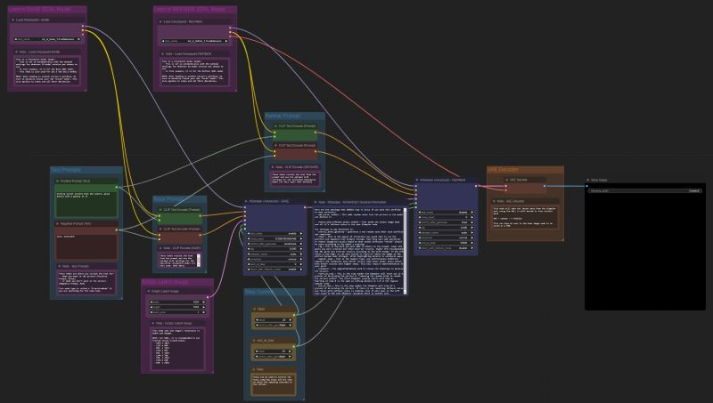
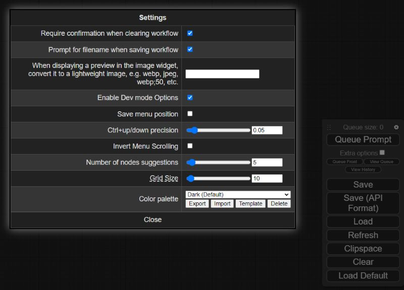

## ComfyUI-to-Python-Extension


The `ComfyUI-to-Python-Extension` is a powerful tool that translates [ComfyUI](https://github.com/comfyanonymous/ComfyUI) workflows into executable Python code. Designed to bridge the gap between ComfyUI's visual interface and Python's programming environment, this script facilitates the seamless transition from design to code execution. Whether you're a data scientist, a software developer, or an AI enthusiast, this tool streamlines the process of implementing ComfyUI workflows in Python.

**Convert this:**




**To this:**

```
import random
import torch
import sys

sys.path.append("../")
from nodes import (
    VAEDecode,
    KSamplerAdvanced,
    EmptyLatentImage,
    SaveImage,
    CheckpointLoaderSimple,
    CLIPTextEncode,
)


def main():
    with torch.inference_mode():
        checkpointloadersimple = CheckpointLoaderSimple()
        checkpointloadersimple_4 = checkpointloadersimple.load_checkpoint(
            ckpt_name="sd_xl_base_1.0.safetensors"
        )

        emptylatentimage = EmptyLatentImage()
        emptylatentimage_5 = emptylatentimage.generate(
            width=1024, height=1024, batch_size=1
        )

        cliptextencode = CLIPTextEncode()
        cliptextencode_6 = cliptextencode.encode(
            text="evening sunset scenery blue sky nature, glass bottle with a galaxy in it",
            clip=checkpointloadersimple_4[1],
        )

        cliptextencode_7 = cliptextencode.encode(
            text="text, watermark", clip=checkpointloadersimple_4[1]
        )

        checkpointloadersimple_12 = checkpointloadersimple.load_checkpoint(
            ckpt_name="sd_xl_refiner_1.0.safetensors"
        )

        cliptextencode_15 = cliptextencode.encode(
            text="evening sunset scenery blue sky nature, glass bottle with a galaxy in it",
            clip=checkpointloadersimple_12[1],
        )

        cliptextencode_16 = cliptextencode.encode(
            text="text, watermark", clip=checkpointloadersimple_12[1]
        )

        ksampleradvanced = KSamplerAdvanced()
        vaedecode = VAEDecode()
        saveimage = SaveImage()

        for q in range(10):
            ksampleradvanced_10 = ksampleradvanced.sample(
                add_noise="enable",
                noise_seed=random.randint(1, 2**64),
                steps=25,
                cfg=8,
                sampler_name="euler",
                scheduler="normal",
                start_at_step=0,
                end_at_step=20,
                return_with_leftover_noise="enable",
                model=checkpointloadersimple_4[0],
                positive=cliptextencode_6[0],
                negative=cliptextencode_7[0],
                latent_image=emptylatentimage_5[0],
            )

            ksampleradvanced_11 = ksampleradvanced.sample(
                add_noise="disable",
                noise_seed=random.randint(1, 2**64),
                steps=25,
                cfg=8,
                sampler_name="euler",
                scheduler="normal",
                start_at_step=20,
                end_at_step=10000,
                return_with_leftover_noise="disable",
                model=checkpointloadersimple_12[0],
                positive=cliptextencode_15[0],
                negative=cliptextencode_16[0],
                latent_image=ksampleradvanced_10[0],
            )

            vaedecode_17 = vaedecode.decode(
                samples=ksampleradvanced_11[0], vae=checkpointloadersimple_12[2]
            )

            saveimage_19 = saveimage.save_images(
                filename_prefix="ComfyUI", images=vaedecode_17[0]
            )


if __name__ == "__main__":
    main()
```
## Potential Use Cases
- Streamlining the process for creating a lean app or pipeline deployment that uses a ComfyUI workflow
- Creating programmatic experiments for various prompt/parameter values
- Creating large queues for image generation (For example, you could adjust the script to generate 1000 images without clicking ctrl+enter 1000 times)
- Easily expanding or iterating on your architecture in Python once a foundational workflow is in place in the GUI

## V1.3.0 Release Notes
- Generate .py file directly from the ComfyUI Web App


## V1.2.1 Release Notes
- Dynamically change `comfyui_to_python.py` parameters with CLI arguments
- Hotfix to handle nodes that accept kwargs.

## V1.2.0 Release Notes
- Updates to adhere to latest changes from `ComfyUI`

## V1.0.0 Release Notes
- **Use all the custom nodes!**
    - Custom nodes are now supported. If you run into any issues with code execution, first ensure that the each node works as expected in the GUI. If it works in the GUI, but not in the generated script, please submit an issue.


## Installation


1. Navigate to your `ComfyUI/custom_nodes` directory

2. Clone this repo
    ```bash
    git clone https://github.com/pydn/ComfyUI-to-Python-Extension.git
    ```

    After cloning the repo, your `ComfyUI` directory should look like this:
    ```
    /comfy
    /comfy_extras
    /custom_nodes
    --/ComfyUI-to-Python-Extension
    /input
    /models
    /output
    /script_examples
    /web
    .gitignore
    LICENSE
    README.md
    comfyui_screenshot.png
    cuda_mollac.py
    execution.py
    extra_model_paths.yaml.example
    folder_paths.py
    latent_preview.py
    main.py
    nodes.py
    requirements.txt
    server.py
    ```

## Web App Use
1. Launch ComfyUI

2. Load your favorite workflow and click `Save As Script`


3. Type your desired file name into the pop up screen.

4. Move .py file from your downloads folder to your `ComfyUI` directory.

5. Now you can execute the newly created .py file to generate images without launching a server.

## CLI Usage
1. Navigate to the `ComfyUI-to-Python-Extension` folder and install requirements
    ```bash
    pip install -r requirements.txt
    ```

2. Launch ComfyUI, click the gear icon over `Queue Prompt`, then check `Enable Dev mode Options`. **THE SCRIPT WILL NOT WORK IF YOU DO NOT ENABLE THIS OPTION!**



3. Load up your favorite workflows, then click the newly enabled `Save (API Format)` button under Queue Prompt

4. Move the downloaded .json workflow file to your `ComfyUI/ComfyUI-to-Python-Extension` folder

5. If needed, add arguments when executing `comfyui_to_python.py` to update the default `input_file` and `output_file` to match your .json workflow file and desired .py file name. By default, the script will look for a file called `workflow_api.json`. You can also update the `queue_size` variable to your desired number of images that you want to generate in a single script execution. By default, the scripts will generate 10 images. Run `python comfyui_to_python.py --help` for more details.

6a. Run the script with default arguments:
   ```bash
   python comfyui_to_python.py
   ```
6b. Run the script with optional arguments:
   ```bash
   python comfyui_to_python.py --input_file "workflow_api (2).json" --output_file my_workflow.py --queue_size 100
   ```

7. After running `comfyui_to_python.py`, a new .py file will be created in the current working directory. If you made no changes, look for `workflow_api.py`.

8. Now you can execute the newly created .py file to generate images without launching a server.
