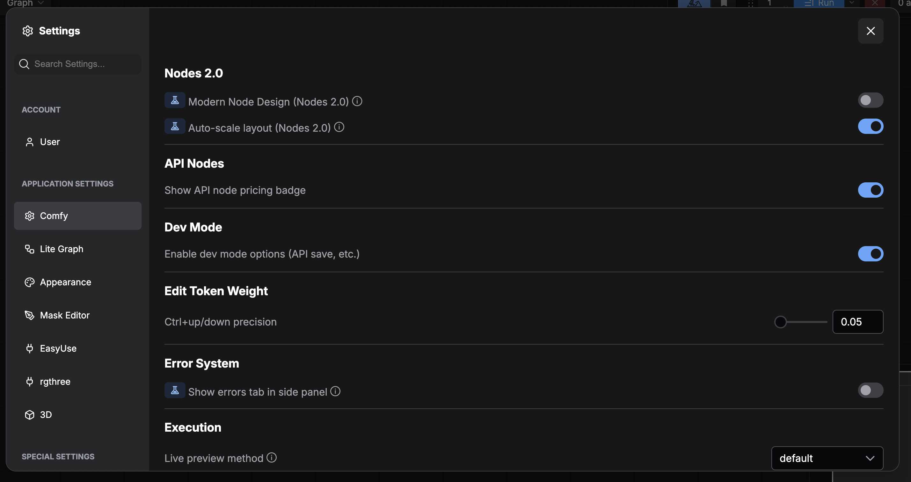

# ComfyUI-to-Python-Extension


Build a workflow in ComfyUI, then walk away with runnable Python.

`ComfyUI-to-Python-Extension` turns visual workflows into executable scripts so you can move from node graphs to automation, experiments, and repeatable generation without rebuilding everything by hand.

This project supports:
- exporting from the ComfyUI UI with `Save As Script`
- converting saved API-format workflows with the CLI

## Install

Choose the setup that matches how you want to use the project.
This project supports Python 3.12 and newer.

### Web UI extension (`File -> Save As Script`)

For ComfyUI to recognize this project as an extension, the repo must be discoverable through ComfyUI's `custom_nodes` search paths.

Use one of these setups:

1. Clone directly into `ComfyUI/custom_nodes`
```bash
cd /path/to/ComfyUI/custom_nodes
git clone https://github.com/pydn/ComfyUI-to-Python-Extension.git
cd ComfyUI-to-Python-Extension
uv sync
```

2. Keep the repo elsewhere, then either:
- symlink it into `ComfyUI/custom_nodes`
- add its parent directory to ComfyUI's `custom_nodes` search paths via `extra_model_paths.yaml`

Example symlink setup:
```bash
git clone https://github.com/pydn/ComfyUI-to-Python-Extension.git
cd /path/to/ComfyUI/custom_nodes
ln -s /path/to/ComfyUI-to-Python-Extension ComfyUI-to-Python-Extension
cd /path/to/ComfyUI-to-Python-Extension
uv sync
```

After installation, restart ComfyUI.

### CLI exporter / generated scripts

You can keep the repo anywhere for CLI usage and generated-script execution.

```bash
git clone https://github.com/pydn/ComfyUI-to-Python-Extension.git
cd ComfyUI-to-Python-Extension
uv sync
export COMFYUI_PATH=/path/to/ComfyUI
```

`COMFYUI_PATH` helps the exporter and generated scripts find the ComfyUI codebase. It does not, by itself, register this repo as a ComfyUI extension for the Web UI.

`COMFYUI_PATH` is checked first. If it is not set, the exporter falls back to searching parent directories for a folder named `ComfyUI`.

## Web UI Export

In current ComfyUI builds, `Save As Script` is typically available under:

`File -> Save As Script`

The command downloads a generated `.py` file.
The current UI export uses the default filename `workflow_api.py` so it works in ComfyUI Desktop without relying on `prompt()`.


Notes:
- menu placement can differ between frontend versions
- the Web UI export uses a fixed default filename rather than asking for one interactively

## CLI Export

1. In ComfyUI, enable dev mode options if needed.
2. Save the workflow in API format: `File -> Export (API)`.
3. Run the exporter:

```bash
uv run python -m comfyui_to_python
```

Options:

```bash
uv run python -m comfyui_to_python \
  --input_file workflow_api.json \
  --output_file workflow_api.py \
  --queue_size 10
```

The legacy wrapper still works if you prefer it:

```bash
uv run python comfyui_to_python.py
```

Flags:
- `--input_file`: input workflow JSON, default `workflow_api.json`
- `--output_file`: output Python file, default `workflow_api.py`
- `--queue_size`: default execution count in the generated script, default `10`



## Generated Scripts

Generated scripts depend on a working ComfyUI runtime.

If the repo is not inside ComfyUI, set:

```bash
export COMFYUI_PATH=/path/to/ComfyUI
```

The generated script is a workflow export. It does not automatically turn workflow inputs into command-line arguments.

Scripts exported directly from `File -> Save As Script` in the ComfyUI UI already include the frontend workflow metadata needed for drag-and-drop reimport. Images saved by those scripts can be dropped back into ComfyUI and reopen with the original workflow metadata.

Generated scripts reuse ComfyUI's runtime argument parser during bootstrap, so common ComfyUI memory flags such as `--highvram`, `--normalvram`, `--lowvram`, `--novram`, `--cpu`, and `--disable-smart-memory` can be passed directly to the exported `.py` file.

Lifecycle notes:
- exported scripts are single-shot workflow runners, not long-lived ComfyUI prompt servers
- they do not implement Web UI prompt/result caching across repeated service calls
- exported `main()` now performs best-effort ComfyUI model/cache cleanup in a `finally` block
- set `COMFYUI_TOPYTHON_UNLOAD_MODELS=1` or call `main(unload_models=True)` if an embedded or repeated-call host should aggressively unload models after each run instead of preserving them for reuse

## Troubleshooting

- unsupported Python version:
  use Python 3.12 or newer, then rerun `uv sync`
- `Save As Script` not visible:
  check your current ComfyUI menu/frontend version and look under `File`
- `Save As Script` not visible after restart:
  make sure this repo is discoverable by ComfyUI through `custom_nodes` by cloning it into `ComfyUI/custom_nodes`, symlinking it there, or adding an external `custom_nodes` path in `extra_model_paths.yaml`
- save uses the default filename:
  rename `workflow_api.py` after download if you want a different local filename
- ComfyUI cannot be found:
  set `COMFYUI_PATH`
- models or paths are missing at runtime:
  verify the target ComfyUI install and its `extra_model_paths.yaml`
