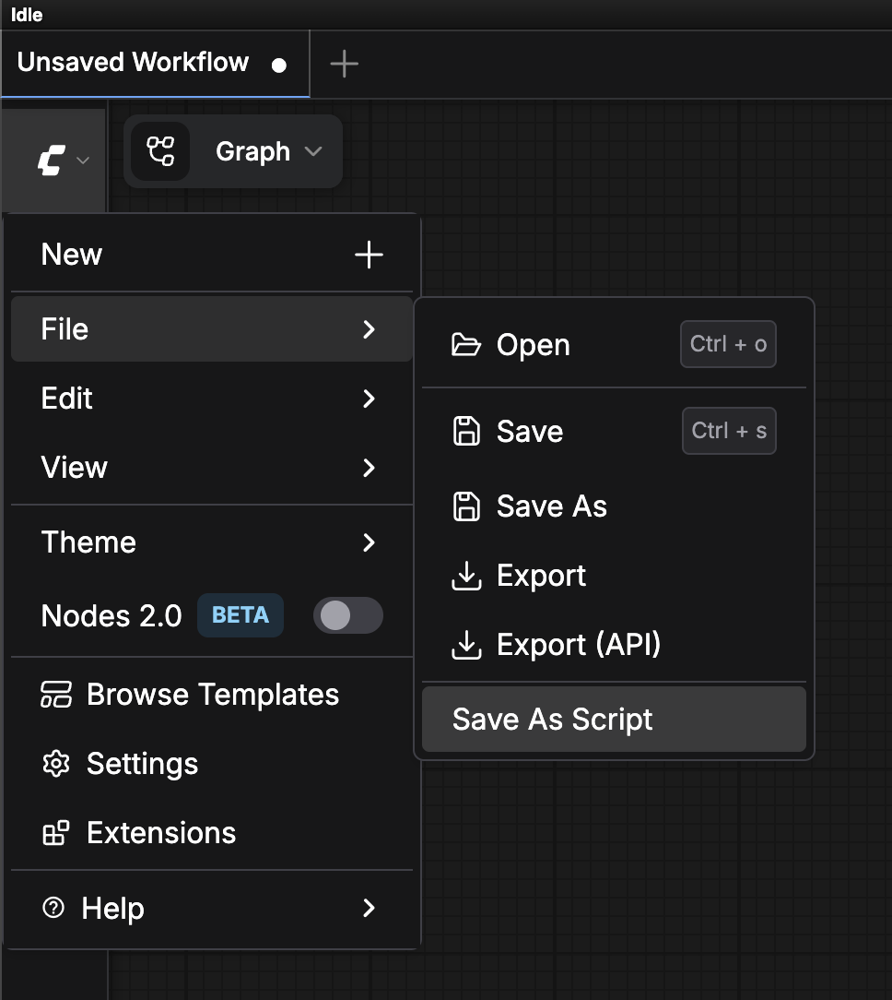

# ComfyUI-to-Python-Extension


Build a workflow in ComfyUI, then walk away with runnable Python.

`ComfyUI-to-Python-Extension` turns visual workflows into executable scripts so you can move from node graphs to automation, experiments, and repeatable generation without rebuilding everything by hand.

This project supports:
- exporting from the ComfyUI UI with `Save As Script`
- converting saved API-format workflows with the CLI

## Install

Use one of these setups:

1. Install inside `ComfyUI/custom_nodes`
```bash
cd /path/to/ComfyUI/custom_nodes
git clone https://github.com/pydn/ComfyUI-to-Python-Extension.git
cd ComfyUI-to-Python-Extension
uv sync
```

2. Keep the repo anywhere and point it at ComfyUI
```bash
git clone https://github.com/pydn/ComfyUI-to-Python-Extension.git
cd ComfyUI-to-Python-Extension
uv sync
export COMFYUI_PATH=/path/to/ComfyUI
```

`COMFYUI_PATH` is checked first. If it is not set, the exporter falls back to searching parent directories for a folder named `ComfyUI`.

## Web UI Export

After installation, restart ComfyUI.

In current ComfyUI builds, `Save As Script` is typically available under:

`File -> Save As Script`

The command downloads a generated `.py` file.



Notes:
- menu placement can differ between frontend versions
- ComfyUI Desktop may fail on the current filename prompt flow; use the CLI flow below if that happens

## CLI Export

1. In ComfyUI, enable dev mode options if needed.
2. Save the workflow in API format: `File -> Export (API)`.
3. Run the exporter:

```bash
uv run python comfyui_to_python.py
```

Options:

```bash
uv run python comfyui_to_python.py \
  --input_file workflow_api.json \
  --output_file workflow_api.py \
  --queue_size 10
```

Flags:
- `--input_file`: input workflow JSON, default `workflow_api.json`
- `--output_file`: output Python file, default `workflow_api.py`
- `--queue_size`: default execution count in the generated script, default `10`


## Generated Scripts

Generated scripts depend on a working ComfyUI runtime.

If the repo is not inside ComfyUI, set:

```bash
export COMFYUI_PATH=/path/to/ComfyUI
```

The generated script is a workflow export. It does not automatically turn workflow inputs into command-line arguments.

## Troubleshooting

- `Save As Script` not visible:
  check your current ComfyUI menu/frontend version and look under `File`
- Desktop says `prompt()` is unsupported:
  use the CLI export flow instead
- ComfyUI cannot be found:
  set `COMFYUI_PATH`
- models or paths are missing at runtime:
  verify the target ComfyUI install and its `extra_model_paths.yaml`
